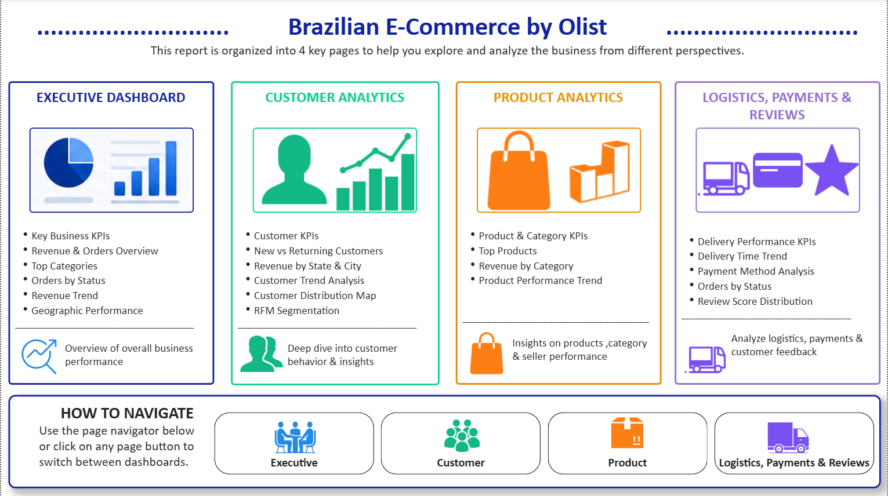

# [Project 1: Brazilian E-Commerce Analytics Dashboard](https://github.com/rohanshendeDA/Brazilian-E-Commerce-by-Olist-Data-Analysis)

  This is a project I did as my Personal Project, where I build Dashboard To analyze key business metrics such as sales, customer behavior, product performance,        logistics, and customer satisfaction.

  * Developed an interactive Power BI dashboard using the Brazilian E-Commerce Public Dataset by Olist to analyze sales performance, customer behavior, product           trends, logistics, payments, and customer reviews.
  * Utilized Power Query, DAX, and data modeling to create dynamic KPIs and interactive dashboards covering executive, customer, product, and logistics analytics. 
  * Data Source: Public dataset from Kaggle – Brazilian E-Commerce Public Dataset by Olist, containing customer, order, product, seller, payment, review, and             geolocation data.

### Dashboard Navigation

### Executive Dashboard

### Customer Analytics

### Product Analytics

### Logistics, Payments & Reviews

# [Project 2: CRM Analytics Dashboard](https://github.com/rohanshendeDA/Insurance-Analytics)

  * Developed an end-to-end Insurance Analytics solution to analyze policy performance, premium growth, claims, customer demographics, branch operations, and          sales opportunities.
  * Built interactive dashboards with KPIs and visualizations to monitor operational performance and support strategic business decisions.
  * Data Source: A small anonymized extract of organizational insurance data provided during my office trainee program, including policy, customer, claims,            premium, branch, and sales-related information.

### Branch Dashboard

### Policy Dashboard
    

# [Project 3: CRM Analytics Dashboard](https://github.com/rohanshendeDA/CRM-Analytics)

  This is a project I did To provide management with a centralized view of the sales pipeline and CRM performance. To identify bottlenecks in the sales process and improve decision-making using interactive dashboards. To automate reporting and reduce manual analysis by transforming CRM data into actionable business insights.
  
  * Designed interactive CRM dashboards analyze the complete sales pipeline, including lead generation, opportunity conversion, revenue trends, and sales              performance.
  * Performed data cleaning, SQL querying, KPI development, and dashboard creation to provide actionable insights for sales and business decision-making. 
  * Data Source: A small anonymized extract of organizational CRM data provided during my office trainee program, containing lead, opportunity, account, and sales     pipeline information.
  This is a project I did to provide a comprehensive view of insurance operations.
  
### Lead Analysis Dashboard

### Opportunity Analysis Dashboard

